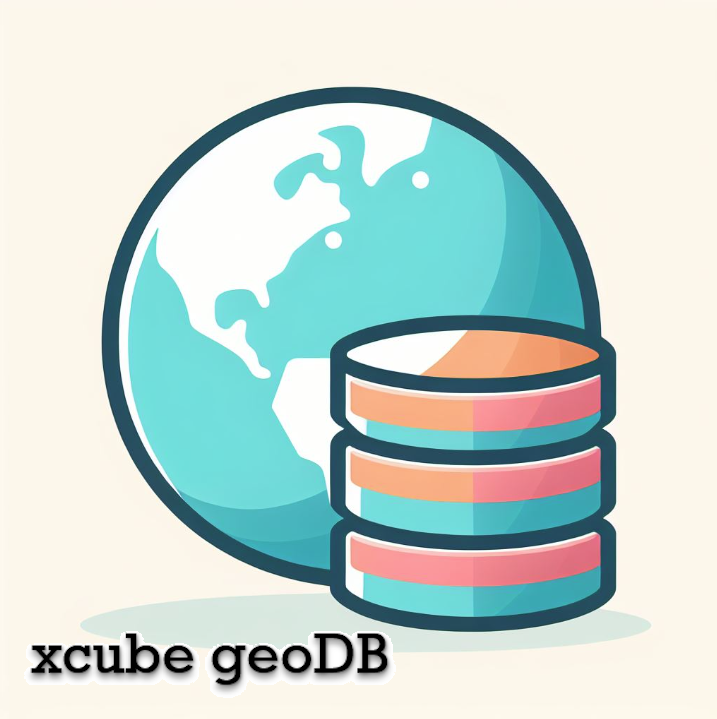

# xcube geoDB - A feature database within the xcube EO datacube ecosystem

xcube geoDB is actively being developed by
[Brockmann Consult GmbH](https://www.brockmann-consult.de) to generate,
manipulate, analyze, and publish geospatial feature collections. It provides
a Python client that offers various functions for classic CRUD operations on
feature collections. xcube geoDB is implemented as a high-performance,
cloud-hosted [PostgreSQL](https://www.postgresql.org/) /
[PostGIS](https://postgis.net/) DBMS with a
[PostgREST](https://github.com/PostgREST/postgrest) frontend. Its OGC WFS and WMS
capabilities are provided by an associated GeoServer instance that operates
directly on the database.

------------
Get started
------------

There are multiple options to use the xcube geoDB:

- create an account at the ESA EuroDataCube platform
- create an account at the ESA EO-TDL platform
- or install yourself (see the [installation guide](installation.md))

Want your own, tailored and turn-key installation of the xcube geoDB? Contact
[the xcube team](mailto:xcube-team@brockmann-consult.de).

------------
Technologies
------------

- [Python](https://www.python.org/)
- [GeoPandas](https://geopandas.org/)
- [PostgreSQL](https://www.postgresql.org/)
- [PostgREST](http://postgrest.org/)
- [docker](https://www.docker.com/)
- [AWS RDS](https://aws.amazon.com/de/rds/)
